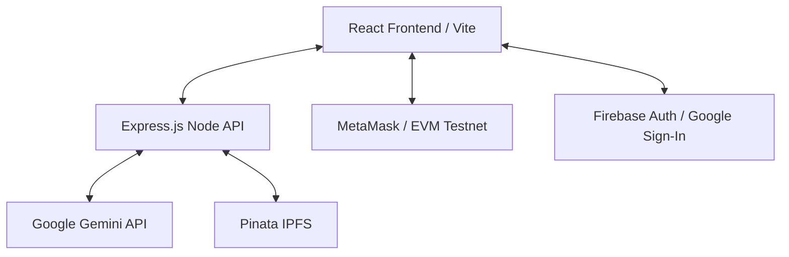

# CarbonIQ: Blockchain-Based Blue Carbon Registry & MRV System

Welcome to the CarbonIQ codebase documentation. CarbonIQ is a modern web application and decentralized platform built to verify, audit, and registry Blue Carbon offset credits (mangroves, seagrasses, etc.) using AI-assisted analysis and EVM smart contracts.

---

## 🌟 Architecture Overview

CarbonIQ utilizes a multi-layered modern stack to achieve decentralized consensus, AI auditing, and secure off-chain states:



### Key Subsystems:
1. **Frontend Interface (React + Vite)**: A premium responsive UI styled with vanilla CSS/TailwindCSS and shadcn/lucide. Built with React Router and React Query for reliable state synchronization.
2. **AI Audit System (Gemini API)**: Audits uploaded PDF documents to verify carbon-offset reports and suggest token quantities.
3. **Decentralized Ledger (Solidity EVM)**: Implemented as [BlueCarbonToken.sol](file:///c:/Users/Sanjay/Downloads/CARBONIQ-1/contracts/BlueCarbonToken.sol) (`BCCT`), allowing secure minting, verification, and burning of carbon offsets on EVM networks.
4. **Decentralized Storage (Pinata IPFS)**: Off-chain tracking of user balances and marketplace listings mapped directly to IPFS hashes.
5. **Authentication Layer**: Dual authentication system with Google Sign-In (Firebase) for developers and secure admin token validation for registry auditors.

---

## 📁 Directory & Key File Structure

This repository is organized as a unified, deployable monorepo:

### 1. Root Configurations & Deployments
- [package.json](file:///c:/Users/Sanjay/Downloads/CARBONIQ-1/package.json): Defines workspace dependencies, dev scripts (`npm run dev`), build commands, and package configurations.
- [README.md](file:///c:/Users/Sanjay/Downloads/CARBONIQ-1/README.md): Simple welcome file with a project demonstration video link.
- [hardhat.config.js](file:///c:/Users/Sanjay/Downloads/CARBONIQ-1/hardhat.config.js): Compiles and manages Solidity contract deployment onto Ethereum networks.
- [wrangler.toml](file:///c:/Users/Sanjay/Downloads/CARBONIQ-1/wrangler.toml) / [netlify.toml](file:///c:/Users/Sanjay/Downloads/CARBONIQ-1/netlify.toml) / [vercel.json](file:///c:/Users/Sanjay/Downloads/CARBONIQ-1/vercel.json): Cloud deployment configuration files targeting Cloudflare Pages, Netlify Functions, and Vercel Serverless respectively.
- [worker-entry.ts](file:///c:/Users/Sanjay/Downloads/CARBONIQ-1/worker-entry.ts): The request/response translator wrapper adapting the Node Express server directly into Cloudflare Workers / Pages environment.

### 2. Smart Contracts (`/contracts`)
- [BlueCarbonToken.sol](file:///c:/Users/Sanjay/Downloads/CARBONIQ-1/contracts/BlueCarbonToken.sol): Standard ERC-20 contract for "Blue Carbon Credit Token" (`BCCT`). Supports:
  - `mintCarbonCredit`: Minting with project metadata (`projectId`, `verificationHash`).
  - `burnCarbonCredit`: Deflationary offset burns.
  - Pausability, blacklists, and admin minter delegation.

### 3. Server-Side Routing & Logic (`/server`)
- [server/index.ts](file:///c:/Users/Sanjay/Downloads/CARBONIQ-1/server/index.ts): Express server bootstrapper, registering standard API endpoints.
- [server/routes/tickets.ts](file:///c:/Users/Sanjay/Downloads/CARBONIQ-1/server/routes/tickets.ts): Backend endpoints for creating, listing, updating, and deleting MRV tickets.
- [server/routes/analyze.ts](file:///c:/Users/Sanjay/Downloads/CARBONIQ-1/server/routes/analyze.ts): Communicates with the Google Gemini API to analyze PDF reports, extracting estimated tokens and confidence scores.
- [server/routes/balance.ts](file:///c:/Users/Sanjay/Downloads/CARBONIQ-1/server/routes/balance.ts): Manages user balances (rupees and tokens) by writing data records to IPFS using Pinata API, with an in-memory fallback.
- [server/routes/marketplace.ts](file:///c:/Users/Sanjay/Downloads/CARBONIQ-1/server/routes/marketplace.ts): Standard operations for listing and buying carbon credits in the marketplace, verifying token holdings and currency balances.
- [server/routes/store.ts](file:///c:/Users/Sanjay/Downloads/CARBONIQ-1/server/routes/store.ts): Handles ticket storage on IPFS/Pinata and local fallback (`server/data/tickets.json`).

### 4. Shared Types & Schemas (`/shared`)
- [shared/api.ts](file:///c:/Users/Sanjay/Downloads/CARBONIQ-1/shared/api.ts): Strong API contract types and request/response interfaces shared between client and server.

### 5. Client Frontend (`/client`)
- [client/App.tsx](file:///c:/Users/Sanjay/Downloads/CARBONIQ-1/client/App.tsx): Frontend routing configurations and contexts providers wrapping.
- `/client/pages`:
  - [Index.tsx](file:///c:/Users/Sanjay/Downloads/CARBONIQ-1/client/pages/Index.tsx): Landing page inviting users to authenticate via Google and connect MetaMask.
  - [Dashboard.tsx](file:///c:/Users/Sanjay/Downloads/CARBONIQ-1/client/pages/Dashboard.tsx): The main project developer dashboard where developers upload carbon reports, review AI analysis results, and create MRV tickets.
  - [Admin.tsx](file:///c:/Users/Sanjay/Downloads/CARBONIQ-1/client/pages/Admin.tsx): Admin console used to review MRV tickets, verify projects, deploy smart contracts, and execute on-chain minting commands.
  - [Marketplace.tsx](file:///c:/Users/Sanjay/Downloads/CARBONIQ-1/client/pages/Marketplace.tsx): P2P marketplace for buying/selling carbon credits using off-chain balances.
- `/client/components`:
  - [MintingInterface.tsx](file:///c:/Users/Sanjay/Downloads/CARBONIQ-1/client/components/MintingInterface.tsx): UI to configure and trigger on-chain mints to developers.
  - [ContractDeployer.tsx](file:///c:/Users/Sanjay/Downloads/CARBONIQ-1/client/components/ContractDeployer.tsx): Compiles/deploys smart contracts directly from browser environment.
  - [TestnetFaucet.tsx](file:///c:/Users/Sanjay/Downloads/CARBONIQ-1/client/components/TestnetFaucet.tsx): A faucet dashboard for getting test tokens.
- `/client/hooks`:
  - [useWallet.tsx](file:///c:/Users/Sanjay/Downloads/CARBONIQ-1/client/hooks/useWallet.tsx): Low-level MetaMask interface managing accounts, chain ID, and reconnect triggers.
  - [useMinting.tsx](file:///c:/Users/Sanjay/Downloads/CARBONIQ-1/client/hooks/useMinting.tsx): Handles transaction gas estimates and blockchain transaction dispatching for carbon mints.
- `/client/lib`:
  - [firebase.ts](file:///c:/Users/Sanjay/Downloads/CARBONIQ-1/client/lib/firebase.ts): Firebase configuration mapping to Google Auth.
  - [contractUtils.ts](file:///c:/Users/Sanjay/Downloads/CARBONIQ-1/client/lib/contractUtils.ts): EVM helper functions (ABI encoding, gas calculations, errors parsing, etc.).

### 6. Deployment Scripts (`/scripts`)
- [scripts/setup-testnet.js](file:///c:/Users/Sanjay/Downloads/CARBONIQ-1/scripts/setup-testnet.js): Automated command line utility to compile/deploy the token onto testnets and configure environmental variables.

---

## 🔄 Core System Workflows

### 1. MRV Evidence Upload & AI Verification
1. User logs in with Google (via Firebase) and links their MetaMask Wallet.
2. The user uploads a project PDF (e.g. reforestation report) on the [Dashboard.tsx](file:///c:/Users/Sanjay/Downloads/CARBONIQ-1/client/pages/Dashboard.tsx) page.
3. The file is converted to Base64 and sent to the `POST /api/analyze-report` endpoint ([analyze.ts](file:///c:/Users/Sanjay/Downloads/CARBONIQ-1/server/routes/analyze.ts)).
4. The backend calls the Google Gemini API with the PDF data, instructing it to analyze project assertions and output structured carbon calculations.
5. The extracted carbon offset estimations are returned to the user.
6. The user submits a Ticket, saving it to IPFS/disk through `POST /api/tickets` ([tickets.ts](file:///c:/Users/Sanjay/Downloads/CARBONIQ-1/server/routes/tickets.ts)).

### 2. Admin Review & Token Minting
1. The admin authenticates at the [Admin.tsx](file:///c:/Users/Sanjay/Downloads/CARBONIQ-1/client/pages/Admin.tsx) console.
2. The admin views pending tickets listed from `GET /api/tickets`.
3. The admin audits the AI output and project details.
4. Once verified, the admin executes the on-chain minting transaction using MetaMask via the [MintingInterface.tsx](file:///c:/Users/Sanjay/Downloads/CARBONIQ-1/client/components/MintingInterface.tsx) component.
5. Under the hood, [useMinting.tsx](file:///c:/Users/Sanjay/Downloads/CARBONIQ-1/client/hooks/useMinting.tsx) constructs the transaction payload calling `mintCarbonCredit(...)` on the deployed ERC-20 smart contract.
6. Upon transaction confirmation, the backend ticket is marked as `approved` and the on-chain txHash is pinned along with the ticket record.

### 3. Account Balances and Ledger Tracking
- Carbon credit balances are queried directly from the smart contract address on-chain or read from IPFS using a mapping of lowercased emails inside [balance.ts](file:///c:/Users/Sanjay/Downloads/CARBONIQ-1/server/routes/balance.ts).
- For users without a wallet connection or when dealing with fiat representations, the system maintains a Rupees ledger mapped through IPFS JSON pins.

### 4. Marketplace Trading
- Carbon credit owners can list their holdings for trade at a chosen rate via `POST /api/marketplace/list` ([marketplace.ts](file:///c:/Users/Sanjay/Downloads/CARBONIQ-1/server/routes/marketplace.ts)).
- Interested buyers purchase these listings via `POST /api/marketplace/buy`, performing atomic balance settlements (adjusting rupees and token quantities in IPFS balance objects).

---

## 🛠 Setup & Running Locally

### Prerequisites
- Node.js (v18+) or Bun installed
- A MetaMask browser extension
- Google Gemini API key (for AI Auditing)
- (Optional) Pinata JWT/API Key (for IPFS synchronization)

### Environment Variables
Configure your environment by duplicating `.env.example` into a `.env` file at the root:
```env
GEMINI_API_KEY="your-gemini-api-key"
PINATA_JWT="your-pinata-jwt-if-using"
```

### Installation
```bash
# Install package dependencies
npm install

# Start both backend API server and frontend SPA in development mode
npm run dev
```

### Contract Deployment
To compile and deploy smart contracts onto Hardhat Localhost network:
```bash
# Spin up local Hardhat EVM node
npx hardhat node

# Compile and deploy contract
node scripts/setup-testnet.js
```

---

> [!NOTE]
> When executing actions locally, CarbonIQ falls back to in-memory databases if Pinata credentials are not supplied. Ensure `server/data/tickets.json` is writable.

> [!TIP]
> Keep your MetaMask browser wallet configured to the RPC URL of the test network (e.g. `http://127.0.0.1:8545` for localhost node) to successfully deploy contracts and mint tokens.
